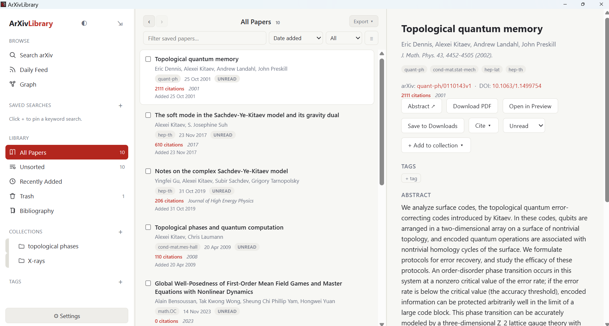
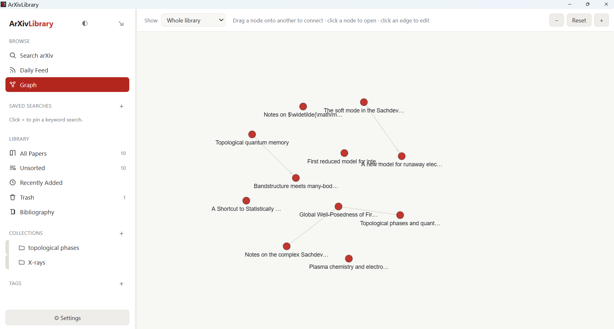
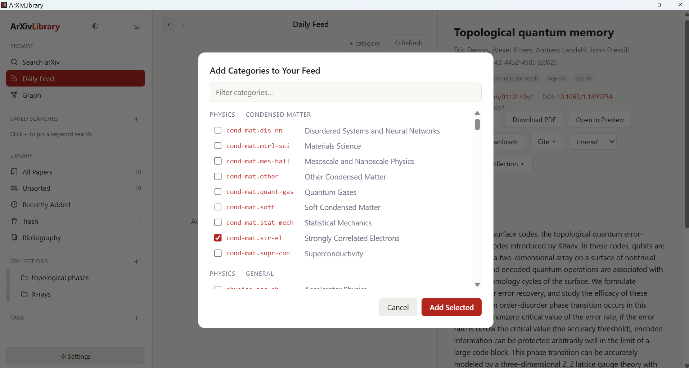

<div align="center">

# ArXivLibrary

**An arXiv-native desktop research library manager for researchers.**

Search, organize, and connect papers — all from a fast native desktop app.

[](https://github.com/Pankajsharma05/ArXiv-Library-releases/releases/latest)
&nbsp;




</div>

---

## Overview

ArXivLibrary is a desktop research library built around the arXiv workflow —
a fast, arXiv-first way to search, save, and organize papers, with citation
data and bibliography tools built in.

This is a weekend project built by a researcher to make everyday arXiv work a
little smoother. It's shared freely in the hope that others find it useful.

### Features

- **arXiv search** — full-text and advanced fielded search, pagination, search history, and Cmd+K quick search
- **Library** — save papers into nested, color-coded collections; tags, reading status, and markdown notes
- **Daily Feed** — new papers from the arXiv categories you follow
- **Graph view** — force-directed graph connecting related papers
- **Bibliography** — DOI lookup via Crossref; import/export `.bib` and `.ris`
- **Citations & venues** — enriched via Semantic Scholar
- **Custom themes** — full palette engine from base + accent colors
- **PDF handling** — download and open in your system PDF viewer

---

## Download

Grab the latest build for your platform from the
**[Releases page](https://github.com/Pankajsharma05/ArXiv-Library-releases/releases/latest)**.

| Platform | File | Notes |
|----------|------|-------|
| **Windows** | `ArXivLibrary_v1.0.0_x64_en-US.msi` | Windows 10/11, 64-bit |
| **macOS** | `ArXivLibrary_macOS_v1.0.0.dmg` | Apple Silicon |
| **Linux** | `ArXivLibrary_v1.0.0_amd64.deb` | Debian / Ubuntu, 64-bit |

> **Availability:** builds are currently provided for Apple Silicon Macs,
> 64-bit Windows (x64), and 64-bit Debian/Ubuntu Linux (amd64). Intel Macs,
> ARM Linux, and other formats are not available at this time.

### Install from the command line

```bash
# Windows (PowerShell) — download, then double-click to run the installer
curl.exe -L -O https://github.com/Pankajsharma05/ArXiv-Library/releases/download/v1.0.0/ArXivLibrary_v1.0.0_x64_en-US.msi

# macOS (Apple Silicon)
curl -L -O https://github.com/Pankajsharma05/ArXiv-Library/releases/download/v1.0.0/ArXivLibrary_macOS_v1.0.0.dmg

# Linux (Debian / Ubuntu)
curl -L -O https://github.com/Pankajsharma05/ArXiv-Library/releases/download/v1.0.0/ArXivLibrary_v1.0.0_amd64.deb
sudo dpkg -i ArXivLibrary_v1.0.0_amd64.deb
```

---

## Installation notes

The application is not code-signed, so each operating system shows a
one-time security prompt on first launch. This is expected for
independently distributed software.

**Windows** — Double-click the `.msi` to install. Windows SmartScreen may
show a warning; click **More info → Run anyway**.

**macOS** — Open the `.dmg` and drag ArXivLibrary to Applications. On first
launch, right-click the app and choose **Open**, then confirm. If macOS still
blocks it, run:

```bash
xattr -cr /Applications/ArXivLibrary.app
```

**Linux** — Install the `.deb` with:

```bash
sudo dpkg -i ArXivLibrary_v1.0.0_amd64.deb
```

If dependencies are missing, follow up with `sudo apt-get install -f`.

---

## Screenshots

| Graph view | Daily Feed |
|:----------:|:----------:|
|  |  |

---

## Feedback

Found a bug or have a feature request? Please
[open an issue](https://github.com/Pankajsharma05/ArXiv-Library-releases/issues).

---

## Acknowledgements

ArXivLibrary is built on top of several free, openly accessible services.
Sincere thanks to the teams and communities behind them:

- **[arXiv](https://arxiv.org)** and its API — open access to preprints and the metadata this app is built around
- **[Semantic Scholar](https://www.semanticscholar.org)** — citation counts and venue data
- **[Crossref](https://www.crossref.org)** — DOI lookup and bibliographic metadata

This project would not be possible without their open APIs.

---

## License

ArXivLibrary is proprietary software, free for personal and academic use.
See [LICENSE](LICENSE) for details.

Copyright © 2026 Pankaj Sharma.
